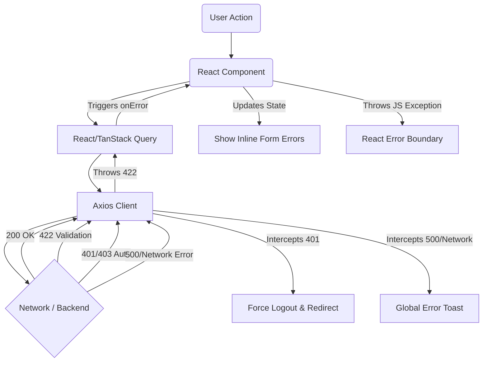
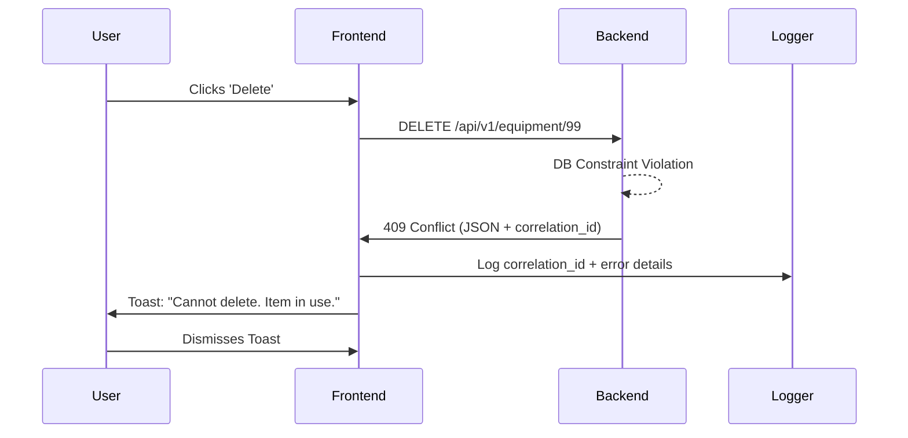

# FRONTEND ERROR HANDLING GUIDE

## Overview

Welcome to the comprehensive Frontend Error Handling Guide. This document defines the philosophy, architecture, and exact procedures for handling errors in our React/TypeScript frontend.

### Error Handling Philosophy
1. **Never Fail Silently:** Every error must be handled or escalated to an Error Boundary.
2. **Standardize the UX:** Users should experience consistent error states (toasts for transients, inline errors for forms, full-page fallbacks for crashes).
3. **Traceability:** Every unhandled frontend error and every 500+ backend error MUST be logged with its `correlation_id` to trace backend-frontend boundaries.
4. **Defensive Programming:** Always assume the network is hostile, the backend might fail, and the token might expire mid-request.

---

## Error Architecture

We categorize errors into the following layers:

- **Validation Errors (422):** Form-level issues. Handled inline beneath input fields.
- **Route/Navigation Errors (404):** Invalid URLs. Handled by React Router's `errorElement`.
- **API/Network Errors (5xx, 429, Offline):** Handled by global Axios interceptors and React Query `onError` callbacks.
- **Authentication Errors (401, 403):** Handled by global interceptors (redirect to login or unauthorized page).
- **Unexpected/Crash Errors (Exceptions):** Handled by React `<ErrorBoundary>`.

### Architecture Diagram


---

## API Error Handling Matrix

The backend enforces a strict JSON error contract. All errors contain `{ success: false, code: string, message: string, correlation_id: string }`.

| HTTP Status | Code | Meaning | Frontend Behavior | User Message | Retry Strategy | Recovery |
| :--- | :--- | :--- | :--- | :--- | :--- | :--- |
| **200/201/204** | - | Success | Return data. | (Optional) "Saved successfully" | None | N/A |
| **400** | `BAD_REQUEST` | Malformed request. | Global Toast. | "Invalid request sent." | None | Fix code/payload. |
| **401** | `UNAUTHENTICATED` | Token invalid/missing. | Intercept -> clear state -> Redirect. | "Session expired. Please log in." | None | User re-authenticates. |
| **403** | `FORBIDDEN` | Lacks permission. | Global Toast / Show Unauthorized UI. | "You do not have permission to do this." | None | Request access. |
| **404** | `ENDPOINT_NOT_FOUND` | Bad API route. | Log to Sentry. | N/A (Should not happen) | None | Fix routing. |
| **404** | `RESOURCE_NOT_FOUND` | Item not found. | Redirect to list / Show 404 block. | "The requested item was not found." | None | Return to dashboard. |
| **409** | `STATE_CONFLICT` | Business rule conflict. | Toast / Inline Form Error. | Backend `message` (e.g. "Stock cannot be negative"). | User driven | Refresh data & retry. |
| **422** | `VALIDATION_ERROR` | Validation failed. | Extract `details.errors`, bind to form. | "Please correct the highlighted fields." | User driven | Fix form inputs. |
| **429** | `TOO_MANY_REQUESTS` | Rate limited. | Toast. Delay further requests. | "Too many requests. Please wait." | Exponential | Wait and retry. |
| **500** | `DATABASE_ERROR` | Server failure. | Global Toast + Sentry. | "A system error occurred. Ref: {ID}" | None | Contact support. |
| **502/504**| `EXTERNAL_SERVICE_FAILURE` | Bad Gateway / Timeout. | Global Toast + Sentry. | "Service is temporarily unavailable." | 3 Retries | Wait and retry. |

---

## Validation Error Handling

1. **Client Validation:** Use `zod` alongside `react-hook-form` for immediate feedback before sending requests.
2. **Server Validation:** If the backend returns 422, catch the error in the React Query mutation:
```typescript
onError: (error) => {
  if (error.response?.status === 422) {
    const serverErrors = error.response.data.details.errors;
    Object.keys(serverErrors).forEach((key) => {
      form.setError(key, { type: 'server', message: serverErrors[key][0] });
    });
  }
}
```

---

## Authentication Failures

- **Expired/Invalid Tokens:** The Axios interceptor MUST catch 401. It clears the local storage `token`, resets the global auth state, and redirects `window.location.href = '/login'`.
- **Session Expiration Warning:** Implement a silent refresh token flow or warn the user if JWT is nearing expiration.

---

## Network Failures

- **Offline State:** React Query automatically pauses queries when the browser is offline and resumes when online. Show an "Offline Mode" banner at the top of the app using `navigator.onLine`.
- **Timeouts:** Axios should have a global timeout of `10000ms`. If exceeded, show a Toast: "The request timed out. Please check your connection."
- **Backoff Strategies:** For 502/503/504, React Query is configured to retry 3 times with exponential backoff (`retryDelay: attemptIndex => Math.min(1000 * 2 ** attemptIndex, 30000)`).

---

## React Query / TanStack Query Standards

- **Queries (`useQuery`):** 
  - `retry: 1` for 404s, `retry: 3` for 5xx network errors.
  - Failures trigger Error Boundaries if `useErrorBoundary: true`.
- **Mutations (`useMutation`):**
  - **Optimistic Updates:** Must implement `onMutate` to stash previous data, and `onError` to rollback (`queryClient.setQueryData`).
  - **Invalidation:** Always `onSuccess: () => queryClient.invalidateQueries(...)` to refresh the state.

---

## Form Error Standards

Every form must support these states visually:
- **Loading:** Submit button shows a spinner and is disabled. All inputs disabled to prevent double-entry.
- **Error:** Red borders on inputs. Helper text below inputs.
- **Success:** Toast notification. Form resets or redirects.

---

## Error Boundary Standards

- **Global Error Boundary:** Wraps the root `<App />`. Catches rendering crashes. Shows a full-page "Something went wrong" screen with a "Reload Page" button and an error reporting form.
- **Feature Error Boundary:** Wraps individual pages (e.g., `<InventoryDashboard />`). Prevents a crashed table from taking down the sidebar navigation.

---

## Logging Standards

- **Sentry Integration:** All unhandled promises, Error Boundary catches, and 500+ Axios responses are sent to Sentry.
- **Correlation IDs:** The backend `X-Request-Id` (returned as `correlation_id` in the JSON) MUST be included in the Sentry context:
```typescript
Sentry.setContext("Backend Error", {
    correlation_id: payload.correlation_id,
    code: payload.code
});
```

---

## Error Reporting Workflow



---

## Defensive Programming Checklist

Before merging any PR, Frontend Developers must verify:
- [ ] Zod schema exactly matches backend validation rules.
- [ ] Submit buttons are disabled while `isSubmitting` is true.
- [ ] Fallback UI is present for all lists (empty state, loading state, error state).
- [ ] No `any` types are used for API responses; all responses are strongly typed.
- [ ] Mutation `onError` handlers properly rollback optimistic updates.
- [ ] `catch` blocks do not silently swallow errors (they must at least log to console/Sentry).
- [ ] File uploads have max-size checks on the client matching the server limits (5MB images, 10MB docs).

---

## QA Testing Matrix

QA must execute these scenarios for every feature:
1. **Validation:** Submit empty forms, oversized strings, invalid emails. Verify inline errors.
2. **Auth:** Delete JWT from LocalStorage while browsing. Attempt an action. Verify redirect to login.
3. **Permissions:** Login as standard user, navigate to `/admin/roles` via URL. Verify 403 fallback.
4. **Network:** Use Chrome DevTools to set network to "Offline". Submit form. Verify offline banner and paused request.
5. **Rate Limits:** Rapidly double-click submit buttons. Verify only 1 request fires, or 429 returns a toast.
6. **Server Crash:** Force a 500 response (using Mock Service Worker or backend flags). Verify Toast with `correlation_id`.
