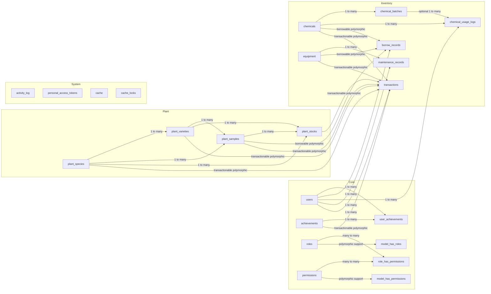

# Simple ERD

Notes:
- `activity_log` and `personal_access_tokens` are polymorphic system tables, so they are shown as standalone tables instead of being tied to one specific model.
- `model_has_roles` and `model_has_permissions` are polymorphic support tables from the permission package.
- `cache` and `cache_locks` have no table relationships, so they stay as standalone system tables.
